Executing same command on multiple ec2 instances simultaneously using Mobaxterm
- This tutorial was done on a Windows 11 Machine

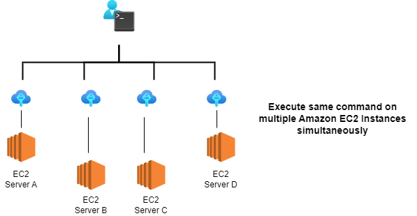

This is what we shall be doing
1. Downloading and installing Mobaxterm on out local computer
2. Launch 4 ec2 ubuntu servers in AWS
3. SSH into the 4 servers using Mobaxterm
4. Running a single curl command to return the public ipv4 address of each instance

### 1. Download latest stable version of Mobaxterm and install it.

Download Mobaxterm from official [Mobaxterm website](https://mobaxterm.mobatek.net/download-home-edition.html)


### 2. Launch 4 Ubuntu Servers and label them A, B, C and D

Choose 4 Ubuntu Instances on the free tier - Ubuntu Server 22.04 


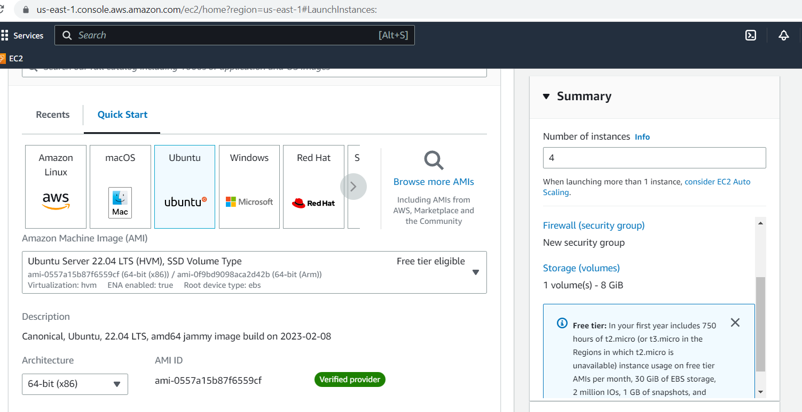


For Instance Type, select t2.micro which is on the free tier to avoid costs

Choose an existing keypair or create one.
I created one called testkeypair.pem


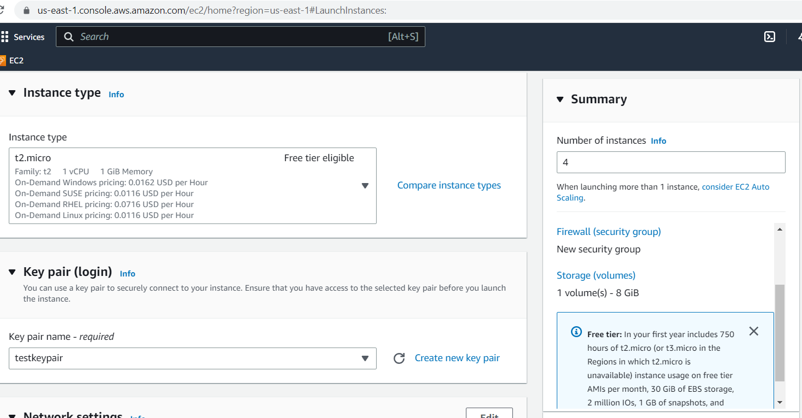


For the firewall settings, allow SSH traffic as we shall need to SSH into our instances to get the public IP addresses later.

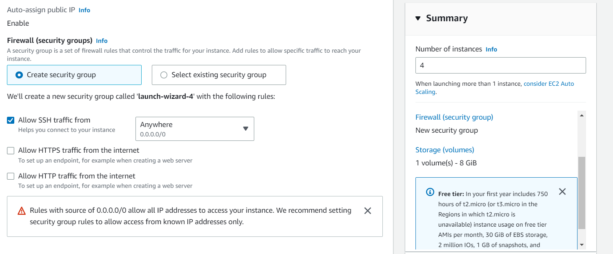


Leave other settings as default and click on Launch Instance

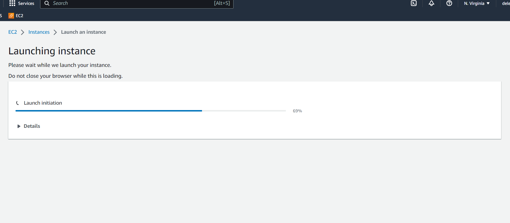


Our 4 instances should be in a running state right now.


Rename each Instance as ServerA, ServerB, ServerC, and ServerD

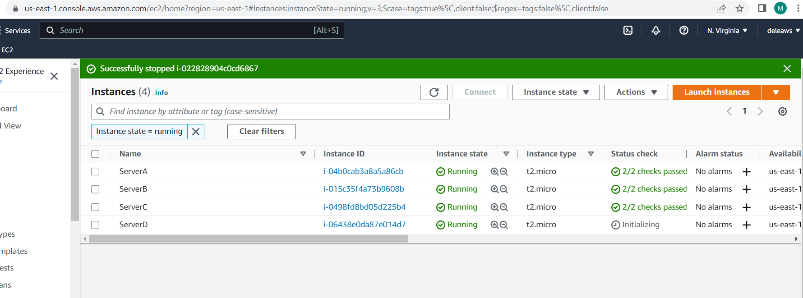


### Launch Mobaxterm and SSH into our 4 servers
- To do this, we shall need their host names, username(ubuntu) and private key that we created.

- Select the checkbox next to the instance and click on connect to see the connection settings

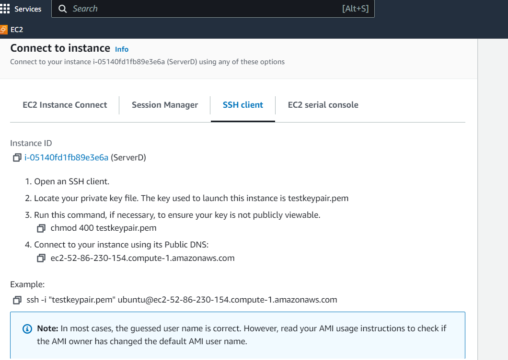


- Click on Session and then choose SSH as the session type.

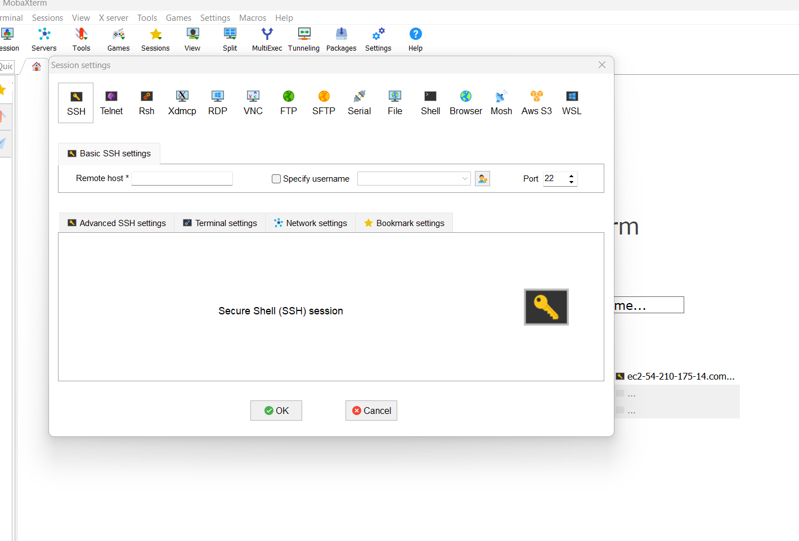

- Username will be ubuntu and remote host will be our AWS PublicDNS such as ec2-34-232-70-251.compute-1.amazonaws.com

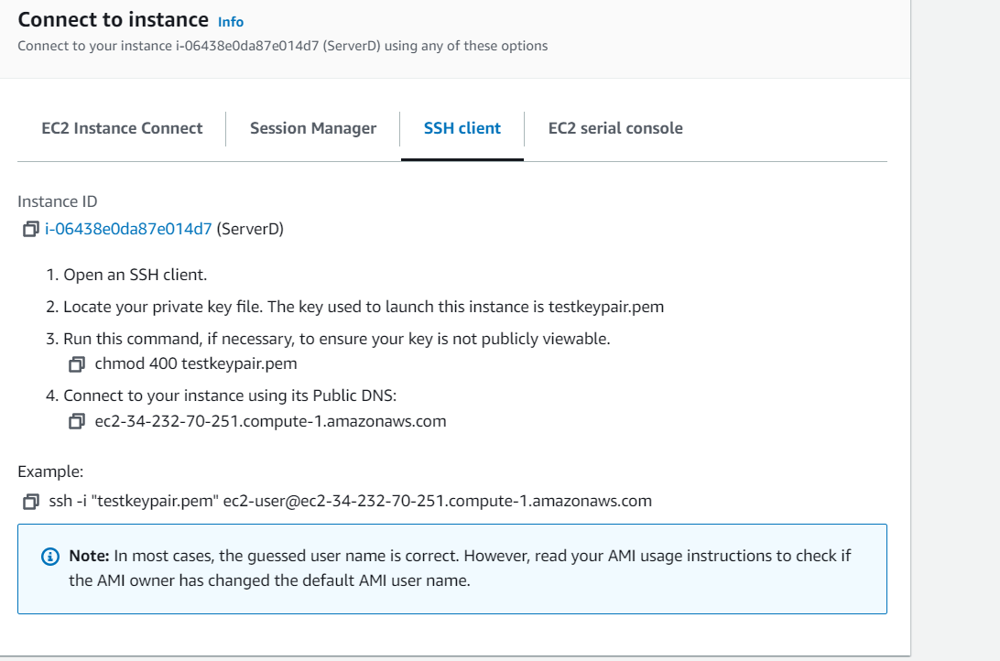

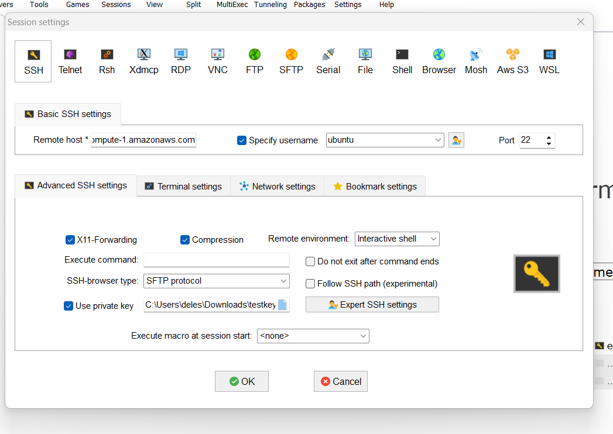


- click on advanced settings, select useprivate key and navigate to the location of the private key on our local system.

- Click Okay

- Repeat this step to SSH into the four ec2 servers and name each tab ServerA -ServerD for differentiation.

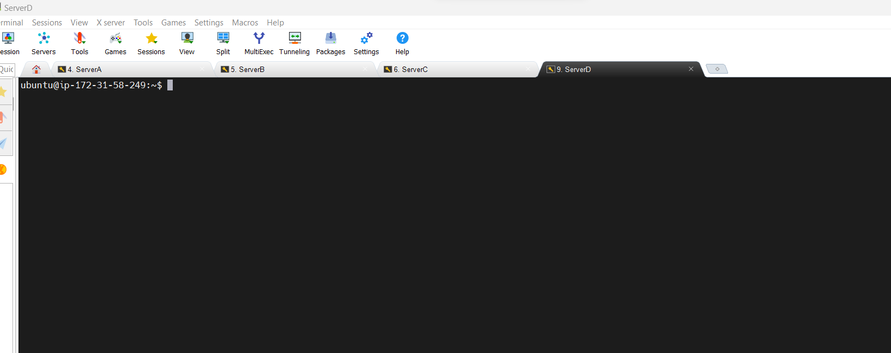

- Click on the MultiExec button in the top menu. 
-- This will allow us to run te same command simutaneously in all terminals and in all ec2 instances

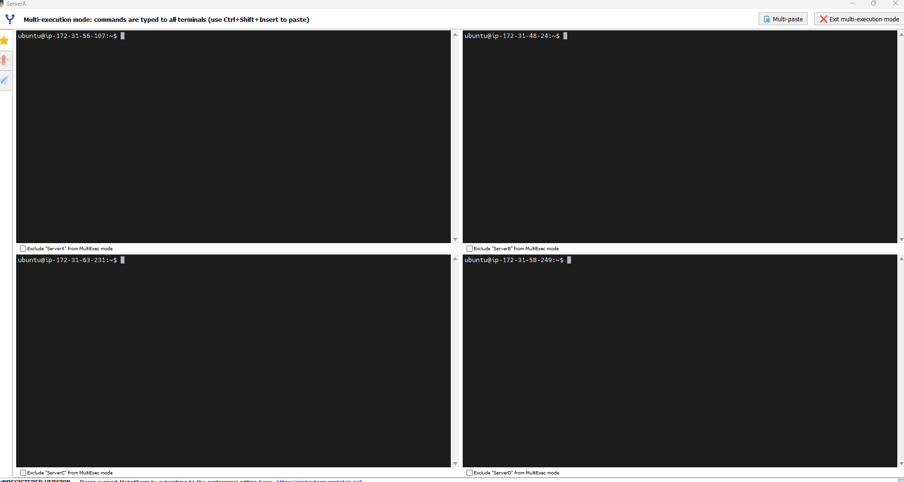

### Our mission is to use curl to return each instances public IPV4 address from it's metadata using the commans
```
curl http://169.254.169.254/latest/meta-data/public-ipv4
```


